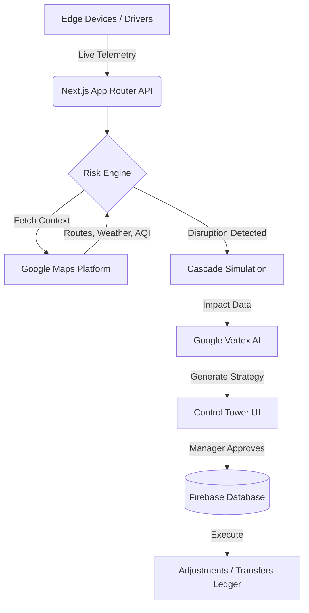

  
  <h1>🏆 SupplyMind</h1>
  <h3>Google SkillBuild Hackathon 2026 | Smart Supply Chains Track</h3>
  
<strong>Transforming global supply chain volatility into Autonomous Strategic Advantage using Google Vertex AI & Maps Platform.</strong>

      

 

## 🌍 The Problem: Billions Lost in the Blind Spots
Global supply chains are incredibly volatile. A sudden storm, a traffic choke point, or a delayed shipment of raw materials doesn't just mean a late truck—it triggers a cascading failure across dependent manufacturing pipelines, costing the industry billions annually. Current legacy tracking systems are reactive, alerting managers only *after* the damage is done.

## 🚀 The Solution: SupplyMind Control Tower
**SupplyMind** is a proactive, AI-driven logistics ecosystem. It doesn't just track fleets; it understands the entire lifecycle of your inventory. By continuously ingesting live telemetry and environmental risk data, SupplyMind’s **Vertex AI Mitigation Engine** preemptively detects disruptions and generates ranked, financially-calculated reroute strategies *before* the bottom line is impacted.

---

## 🏆 Why SupplyMind Wins (Google Cloud Integration)

We didn't just build a dashboard; we deeply integrated the **Google Cloud Ecosystem** to solve high-stakes physical world problems.

### 1. Advanced Location Intelligence (Google Maps Platform)
- 📍 **Routes & Roads APIs**: Live GPS pings from driver mobile apps are snapped to actual road geometries. ETA calculations dynamically shift based on real-time traffic density, directly influencing "Gig Transport" driver payouts.
- 🌦️ **Air Quality & Weather APIs**: Environmental context is injected directly into our custom **Risk Engine**. If a fleet is driving into a severe AQI or extreme weather zone, the system dynamically inflates the risk score and proposes alternate routes.
- 🌐 **Address Validation & Time Zone APIs**: Intelligent warehouse provisioning instantly validates global location geometries and synchronizes operational timezones across the network.
- 📡 **Offline-First Resilience**: Real-time GPS tracking with an **Offline Sync Queue**. Drivers in low-connectivity zones (rural routes, tunnels) continue tracking locally and sync data to the Control Tower automatically once back online.

### 2. Generative Mitigation (Vertex AI & Gemini)
When a high-severity disruption is detected, the AI Control Tower kicks into gear.
- Instead of simple threshold alerts, **Vertex AI** consumes the cascade simulation data and generates actionable, context-aware mitigation strategies (e.g., *Reroute via Air Freight*, *Dispatch Backup Fleet*, *Release Safety Stock*).
- **Cost-Benefit UI**: Decision-makers are presented with a stunning, side-by-side financial comparison of the "Current Plan" (Revenue at Risk) versus the "AI Proposed Plan" (Cost Premium vs. Time Saved).

### 3. High-Performance Backbone (Firebase & Next.js 16)
- **100% Serverless**: Powered by Firebase Admin and Firestore, capable of handling thousands of concurrent telemetry events without breaking a sweat.
- **Enterprise RBAC**: Five distinct role portals seamlessly operating on the same data plane: `ADMIN`, `MANAGER`, `OPERATOR`, `VENDOR`, and `TRANSPORT`.

---

## 🏛️ System Architecture

---

## 🎯 Quick Start for Judges

Experience the platform precisely how an enterprise logistics team would.

### **🌐 Live Ecosystem**
🌐 **[Launch SupplyMind Control Tower](https://stock-master-indol.vercel.app/)** 

**🔑 Demo Credentials:**
| Role | Email | Password | Experience |
| :--- | :--- | :--- | :--- |
| **Executive Admin** | `admin@supplymind.ai` | `password123` | Full visibility, Risk Engine, AI Mitigations |
| **Supplier/Vendor** | `pharma@supplymind.ai` | `password123` | Inbound tracking, Purchase Orders |
| **Gig Driver** | `driver@supplymind.ai` | `password123` | Mobile-optimized delivery execution |

### 🛠️ Evaluation Walkthrough
1. **Log in as Admin** and navigate to the **Control Tower**.
2. Observe the **Active Shipments** and the live **Risk Levels**.
3. Click on a shipment marked **"At Risk"** to open the **Decision Card**.
4. Witness the **Vertex AI Mitigation Strategies**. Compare the exact *Cost Premium* against the *Time Saved* before clicking **Approve**.
5. Navigate to the **Ledger** to see how the AI's autonomous decision was immutably recorded.

---

## 🎨 UI/UX Excellence
Enterprise software shouldn't look like a spreadsheet. SupplyMind employs a state-of-the-art **Glassmorphism Design System**:
- Deep `backdrop-blur-xl` translucent surfaces and micro-interactions.
- GPU-accelerated motion graphics via **Framer Motion** for a truly cinematic entry experience.
- **Adaptive Dark/Light Mode**: Full system theming support with high-contrast optimization for logistics environments.
- **AI Diagnostic Transparency**: Every AI-generated strategy includes a "View Diagnostic Data" option, exposing the raw neural logic and risk vectors for human compliance auditing.

---

  <i>Designed and engineered for the Google SkillBuild 2026 Hackathon.</i> 
  <b>SupplyMind: Logistics, Solved.</b>

